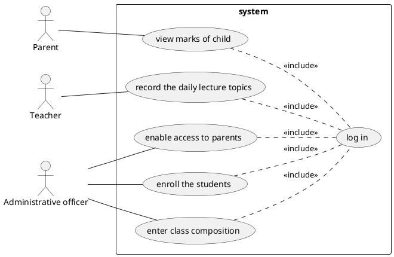

# Use cases

## Story 1

### Name

As a parent I want to know the marks of my child so that I can monitor his/her performance

### Main success scenario

1. Connect to website of the school
2. Select child
3. Read table
4. Leave website, action successful

### Extensions

#### Errors

1. Website down
   - Call teacher
2. No marks to be shown
    - Show no mark

## Story 2

As a teacher I want to record the daily lecture topics so that I can inform parents and students and have an official recording for institutional purposes

### Main success scenario

1. Connect to website of the school
2. Select daily topic page
3. Input daily topic and select subject
4. Push "send" button
5. Action succesful

### Extensions

#### Errors

1. Website down
    - Call sysadmin
2. Insertion failed
    - Retry
    - Retry failed
        - Call sysadmin
3. Database error
    - Call sysadmin

## Story 3

As an administrative officer, I want to enable access to parents

### Main success scenario

1. Log in
2. Insert parent master data / credentials
3. Send email to parent with link to first access / sign up to web portal
4. Receive confirmation email
5. Log out

### Extensions

#### Errors

1.a. web portal system down 
- Call sysadmin

1.b. wrong / forgotten credentials
- retry + print error message 
- password forgotten recovery link

2.a. not correct data inserted
- print error message + suggestions
- check paper/digital document (secretary at the time of parents form filling)

2.b. data already inserted 
- print error message
- avoid insertion of duplicates

2.c. expired session (log again)
- show time expired message + log in page

3.a. mail server down
- call sysadmin

3.b. wrong parents email
- fatal error

3.c. broken link
- call sysadmin

4.a. mail server down
- call sysadmin

4.b. broken link
- call sysadmin

4.c. wrong email destination
- fatal error 

5.a. session timeout
- show timeout message

5.b. leave without log out
- automatically logout after timeout

## Story 4

As an administrative officer I want to enroll the students

### Main success scenario

1. The administrative officer log in into the enroll service
2. The administrative officer input student data
3. A confirmation is showed to the administrative officer
4. A confirmation is sent to parents
5. The administrative officer log out from the enroll service

### Extensions

#### Errors

1. The log in fails: 
    - timeout: ask again log in data
    - wrong data access: ask again log in data
    - the server is down: show messagge and notify when server is up again

2. The enrollment fails:
    - the student data is signalled incorrect: send a notification to parents
    - the student already exists: show message 
    - database failure: show messagge and performe rollback 
    - the server is down: show messagge and notify when server is up again

3. A confirmation to the administrative officer is not showed 
    - the confirmation is not shown but the enrollment is done: give
        the possibility to the administrative officer to ask for enrollment state update in a second time (nel senso di notizie sullo stato)

4. A confirmation to the parent is not sent
    - the confirmation is not shown but the enrollment is done: give
        the possibility to the parents to ask for enrollment state update in a second time (nel senso di notizie sullo stato)

5. The log out fails: 
    - the server is down: show message and notify when server is up again

## Story 5

As an administrative officer I want to enter class composition

### Main success scenario

1. Login 
2. Access insertion form
3. Insert/Select class
4. Insert all students one by one
5. Save/Modify/Delete/Reset
6. Start Again (optional)
7. Logout

### Extensions

#### Errors

1.a. web portal system down 
- call sysadmin

1.b. wrong / forgotten credentials
- retry + print error message 
- password forgotten recovery link

2.a: broken link
- call sysadmin
- show message: do it on paper/ service unavailable at the moment

3.a. duplicated class/already inserted
- show message / does not insert

3.b. class not present in the list
- check better paper document

4.a. duplicated students /already inserted
- show message

b: wrong insertion of a student in a class
- allow to modify/update lists

5.a. database error
- show message / rollback
    
6.a. not allowed
- log again    

6.b. time expired
- log again

6.c. all students/class already inserted
- show message

7.a. session timeout
- show timeout message

7.b. leave without log out
- automatically logout after timeout

# Use case diagram

## Image

## Code

