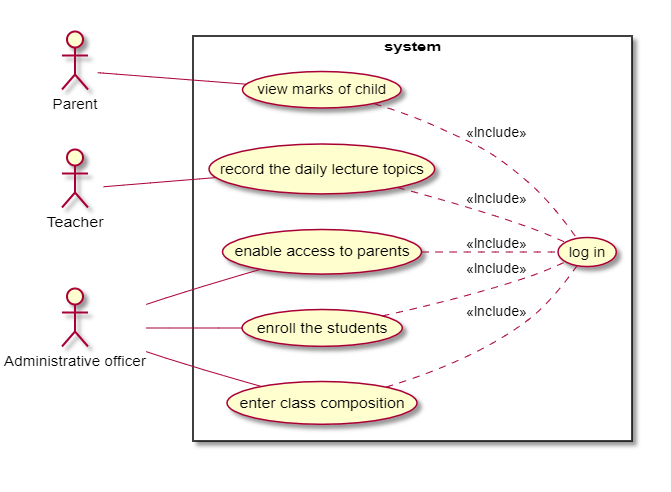
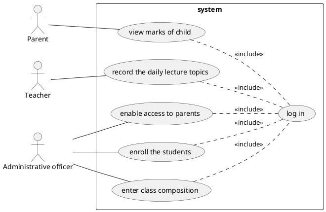

# Use cases

## Story 1

### Name

As a parent I want to know the marks of my child so that I can monitor his/her performance

### MSS

1. Connect to website of the school
2. Select child
3. Read table
4. Leave website, action successful

### Extensions

#### Errors

1. Website down
   - Call teacher
2. No marks to be shown
    - Show no mark

## Story 2

As a teacher I want to record the daily lecture topics so that I can inform parents and students and have an official recording for institutional purposes

### MSS

1. Connect to website of the school
2. Select daily topic page
3. Input daily topic and select subject
4. Push "send" button
5. Action succesful

### Extensions

#### Errors

1. Website down
    - Call sysadmin
2. Insertion failed
    - Retry
    - Retry failed
        - Call sysadmin

# Use case diagram

## Image

## Code

